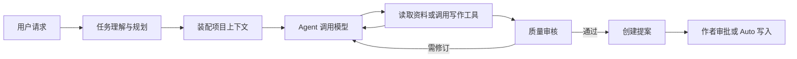

# Writer Agent 框架概览

本文用于快速了解 Writer Agent 的整体结构和核心机制，方便后续定位生成、上下文、工具调用、质量审核和续跑问题。

## 一、整体流程



主 Agent 不是一次性生成器，而是一个循环执行器：理解任务、读取最少必要资料、生成或修改正文、检查结果，再通过提案交付。

主要入口位于：

- `src/agent.ts`：Agent 主循环、提示词装配、任务执行和续跑。
- `src/server.ts`：Web API、后台任务、流式事件和 step 记录。
- `src/store.ts`：会话、消息、任务状态、提案和运行记录。
- `src/tools/`：Agent 可调用的项目工具。
- `src/web/`：Web 工作台。

## 二、任务理解与执行

用户请求进入 Agent 后，系统先把它整理成任务合同，明确：

- 最终要交付回答、文档、角色卡还是规划结果；
- 是否需要读取项目事实；
- 是否允许修改文件；
- 适合直接写全文、局部修改还是使用场景链。

Agent 根据工具结果自主决定下一步，并动态维护 todos。todos 只是可视计划，不参与完成判定，也不规定必须按什么顺序行动。

运行时另外保存一份很薄的 `AgentRunState`：其中的 document obligations 只记录用户要求的独立文档产物，以及每项对应的 proposal/change set 证据。它不是工作流；Agent 仍可自由选择直接成稿、局部修改、资料检索或场景链。模型准备结束时，完成守卫只核验这些要求是否都有真实工具证据，多章任务不会因一个合并 todo 被勾完而提前结束。

相关代码主要在 `src/agentic_runtime.ts`、`src/agent_runtime.ts` 和 `src/agent.ts`。

## 三、上下文机制

Agent 的模型上下文分为三层：

1. **稳定前缀**

   放长期不变的写作规则、执行规则、项目指令、技能目录和风格约束。稳定内容保持固定顺序，以复用供应商提示词缓存。

2. **项目与历史上下文**

   包含项目骨架、角色索引、已冻结的历史回合和跨章节交接摘要。已经读过且未变化的资料可从材料架或缓存复用。

3. **当前任务动态尾部**

   包含本轮任务、todos、工作记忆、用户选区、当前声线样本和用户请求。章节正文和大型资料不会无条件整篇注入，需要时由工具定点读取。

同一次 `runAgent` 中，模型消息只追加，不在中途重写历史。章节或场景完成后可以收束过程上下文，只保留继续写作所需的交接信息。

缓存与消息顺序的权威说明位于 `src/agent.ts` 顶部的 `PROMPT / PREFIX-CACHE CONTRACT`。

## 四、工具系统

工具是 Agent 与项目交互的唯一主要入口，可分为几类：

| 类型 | 作用 |
|---|---|
| 文档工具 | 列出、检索、定位和读取项目文档 |
| 大纲工具 | 查询或修改结构化大纲 |
| 角色工具 | 读取和更新角色资料 |
| 写作工具 | 创建全文、局部补丁或场景草稿 |
| 审核工具 | 检查正文风格、事实和结构 |
| 状态工具 | 管理 todos、工作记忆和项目级复审规则 |

工具 schema 集中在 `src/tools/schema.ts`，执行分发在 `src/tools/execute.ts`。工具集合与顺序保持稳定，实际权限由任务合同和 permission mode 在运行时控制。

## 五、写作路径

当前主要有两条写作路径。

### 直接文档路径

适合 Agent 已能整体把握的章节、短篇或局部修改：

- `propose_document`：新建或整体重写文档。
- `propose_document_patch`：只修改已定位的局部内容。
- 隔离 Writer：由独立写作模型生成正文，再交回主流程审核。

### 场景链

适合需要维护多场连续状态的长章节：

- 先建立章节草稿和场景卡；
- 逐场写作并记录每场结束状态；
- 后一场使用前一场的状态和结尾作为衔接；
- 完成后组装整章并统一终审。

场景链实现主要在 `src/tools/scene_pipeline.ts`。

## 六、质量审核

正文质量不是由单一分数决定，而是分层处理：

- `prose_quality.ts`：定位说明腔、重复解释和高辨识度句式候选。
- `prose_metrics.ts`：检查复读、碎句、节奏和密度。
- `prose_vividness.ts`：评估现场感、感官和具体锚点。
- `ai_tells.ts`：提供生成痕迹统计，只作定位参考。
- `prose_adjudicate.ts`：由审核模型结合上下文判断候选是否真的违规。
- `chapter_review.ts`：整章检查事实、人物认知、连续性、结构和表达。

确定性规则主要负责发现候选，语义模型负责裁决。硬阻断需要引用可定位的正文证据，修订后还会经过同一审核链复检。

例如，“连续罗列人物的成功结果、群众认可和解释性对白来证明人物标签”属于段落级语义问题，不应只靠关键词或正则判断。适合将它作为项目语义复审规则接入 `prose_gate_rules.ts`，再由 `prose_adjudicate.ts` 逐段判断。

## 七、提案与写入

Agent 默认不直接覆盖正文。写作工具先创建 proposal，记录修改前后内容、摘要、质量报告和角色变化：

- Ask 模式：等待作者审批；
- Auto 模式：自动接受提案并写入，但仍保留修订记录；
- Plan 模式：禁止写入类工具。

提案、接受、撤销和重做由 `src/store.ts` 与 `src/tools/proposals.ts` 管理。这个机制把“模型生成”和“项目文件真正变化”分开，便于审阅和恢复。

## 八、后台运行与续跑

Web 端把 Agent 任务作为后台 job 执行，并通过 SSE 推送：

- 当前 step；
- 模型输出和 reasoning；
- 工具调用；
- token 使用量；
- proposal、todos 和终止状态。

step trail 会持久化到数据库，页面刷新后仍可查看。任务因步数预算、人工停止或异常中断时，当前 RunState、todos、checkpoint、材料架和已完成工具结果会保留。续跑恢复同一份未完成约束及其已有提案证据，不再仅靠 todo 文案推断进度。

后台任务只允许 `completed / interrupted / failed / cancelled` 四类终态。运行函数如果没有发出终态就直接返回，后台会生成错误终态，避免 SSE、step 和前端活跃状态彼此不一致。

后台 job 和 step trail 位于 `src/server.ts`，续跑状态恢复位于 `src/agent.ts`、`src/store.ts` 和 `src/web/main.tsx`。

## 九、数据存储

每个项目的运行数据保存在：

```text
<项目>/.writer/writer.db
```

数据库保存会话、消息、提案、修订、模型用量、上下文节点、工具材料、任务状态和 step trail。项目正文、设定和大纲仍以文件形式保存在 `resource/` 下。

数据库查询方法参见 `docs/db-query.md`。

## 十、问题定位顺序

遇到问题时可按下面顺序排查：

1. 任务是否被正确理解，任务合同和 todos 是否符合用户目标；
2. Agent 是否读到了正确文档，是否错误复用了旧材料；
3. 问题出在生成提示、工具输入、工具实现还是审核裁决；
4. 直接文档路径与场景链是否执行了相同的必要审核；
5. proposal 是否创建，还是在质量门禁或终审阶段被退回；
6. 后台 job 是否仍活跃，step trail 是否残留了过期状态；
7. 修改提示词或工具 schema 时，是否破坏了稳定前缀和缓存契约。

这套顺序能够先定位问题所属层级，再决定应修改提示词、语义规则、执行流程还是状态恢复逻辑，避免只对表面现象打补丁。
